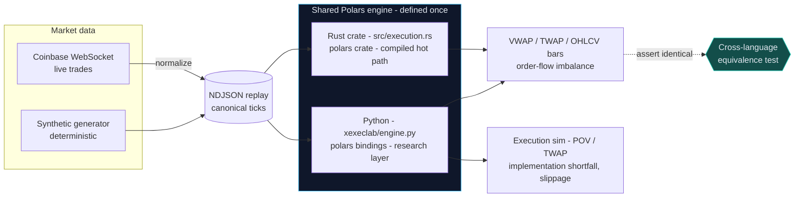

# polars-execution-lab

**One execution-analytics engine, written once in Polars, run from both Rust and Python — proven identical on the same market-data replay.**

Crypto trading desks measure execution the same way equities desks do: against
**VWAP** and **TWAP** benchmarks, by **order-flow imbalance** (which side of the
book drove the trades), and by **implementation shortfall** versus the price when
the order arrived. This project builds that measurement engine over live crypto
tick data — the OHLCV/VWAP bar aggregation and the session
benchmarks are expressed **once** with the [Polars](https://pola.rs) query
engine and executed **natively in Rust** (the compiled hot path) and **in
Python** (the research and evaluation layer). A cross-language test asserts the
two produce **byte-identical** summaries, so "prototype in Python, ship in Rust"
carries zero logic drift.

It is deliberately shaped like a slice of what an onchain market-data / execution
firm (e.g. [LO:TECH](https://lo.tech)) operates: live market data, deterministic
**websocket replay**, and an execution-algorithm suite (VWAP / TWAP / POV) with
transaction-cost analytics.

---

## Architecture



The **replay file is the contract** between languages: the same NDJSON bytes
drive both engines, which is what makes the equivalence guarantee meaningful and
every benchmark reproducible.

---

## Run it

Two toolchains: a Python venv for the analytics/CLI and `cargo` for the Rust
engine. Everything below runs from the repo root.

```bash
# --- Python engine -------------------------------------------------
uv venv && uv pip install -e ".[dev]"

# analytics over the checked-in sample replay
uv run xexeclab summary --input data/sample_ticks.ndjson --bucket-ms 1000
uv run xexeclab eval    --input data/sample_ticks.ndjson --algo pov --side buy --qty 1.0 --participation 0.2

# capture real live market data from Coinbase (no API key needed)
uv run xexeclab ingest --product BTC-USD --out out/btc.ndjson --max-trades 500 --event-log out/events.jsonl
uv run xexeclab summary --input out/btc.ndjson

# --- Rust engine ---------------------------------------------------
cargo run --release --bin xexec -- summary --input data/sample_ticks.ndjson --bucket-ms 1000

# --- prove the two agree -------------------------------------------
cargo build --release
XEXEC_BIN=target/release/xexec uv run pytest -m equivalence
```

---

## Why this stack

| Choice | Rationale |
|---|---|
| **Polars** | One columnar engine with a first-class API in *both* Rust and Python. The bar aggregation and benchmarks are the same lazy expressions on each side, so there is a single source of truth for the maths — not a Rust implementation and a drifting Python re-implementation. |
| **Rust** for the hot path | Compiled, allocation-lean, embeddable. This is the code you would put next to a live feed; the Python mirror is where you prototype and evaluate. |
| **Python** for research | The fill simulation, transaction-cost analytics, and evaluation live where iteration is fastest, over the identical engine. |
| **Coinbase WS** | Genuinely live, tick-level, ungated market data (no API key for market data) — the one free source that makes execution-algorithm analytics *real* rather than illustrative. |
| **NDJSON replay** | A dead-simple, diffable, language-neutral contract. It is the websocket-replay primitive and doubles as the deterministic CI/backtest source. A **Parquet** sink (`xexeclab convert`) is available for large captures where columnar storage pays off. |

## Operational characteristics

- **Deterministic replay**: identical bytes → identical benchmarks, every run,
  both languages.
- **Cross-language equivalence** is enforced in CI, not just documented.
- **Structured observability**: ingest emits a JSONL event log
  (`ingest_start` / `ingest_progress` / `ingest_complete`) with a documented
  schema (see `python/xexeclab/events.py`).
- **Bar width is a parameter** (`--bucket-ms`); benchmarks scale to any horizon.
- CI runs two jobs: Rust (`fmt` + `clippy -D warnings` + `test`) and Python
  (`ruff` + `pytest` + the equivalence test that builds the Rust binary).

## Evaluation

`xexeclab eval` is the quantitative check: it runs POV and TWAP schedules
against the replay and scores each on **slippage versus the session VWAP
benchmark** and **implementation shortfall versus the arrival price**, both in
basis points — the same transaction-cost lens a desk uses to grade an algo.

## Testing

```bash
uv run pytest                                  # Python engine + fills
cargo test --release                           # Rust engine
XEXEC_BIN=target/release/xexec uv run pytest -m equivalence   # both agree
```

---

## Honest disclaimer

This is a **market-data and execution-analytics** project, not a trading system.

- The execution algorithms (POV, TWAP) are **simulated over historical bars**.
  Each child order is assumed to fill at its bar's VWAP with **no market impact**
  and **no order routing** to any venue. It measures *schedule quality*, not live
  execution, and must not be used to trade.
- **Market making and smart order routing** — parts of what a real execution
  firm does — are out of scope here; only the market-data and post-trade
  analytics slice is built.
- Live data comes from Coinbase's public feed; availability and rate limits are
  the exchange's. The checked-in `data/sample_ticks.ndjson` lets every command
  and test run with no network.

## License

MIT — see [LICENSE](LICENSE).
