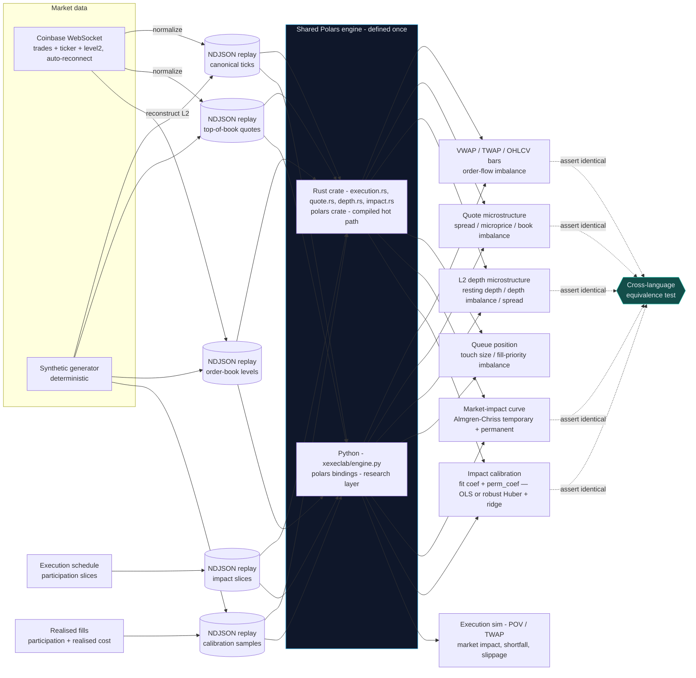

# polars-execution-lab

**One execution-analytics engine, written once in Polars, run from both Rust and Python — proven identical on the same market-data replay.**

Crypto trading desks measure execution the same way equities desks do: against
**VWAP** and **TWAP** benchmarks, by **order-flow imbalance** (which side of the
book drove the trades), by **top-of-book and L2 depth microstructure** (spread,
microprice, resting depth, depth imbalance, top-of-book queue size, the cost of
**sweeping** the book), by the **market impact** a schedule
pays for the size it takes, and by **implementation shortfall** versus the price
when the order arrived. This project builds that measurement
engine over live crypto tick, quote, and order-book data — the aggregations and
benchmarks are expressed **once** with
the [Polars](https://pola.rs) query engine and executed **natively in Rust** (the
compiled hot path) and **in Python** (the research and evaluation layer). A
cross-language test asserts the two produce **byte-identical** summaries, so
"prototype in Python, ship in Rust" carries zero logic drift.

It is deliberately shaped like a slice of what an onchain market-data / execution
firm (e.g. [LO:TECH](https://lo.tech)) operates: live market data, deterministic
**websocket replay**, and an execution-algorithm suite (VWAP / TWAP / POV) with
transaction-cost analytics.

---

## Architecture



The **replay file is the contract** between languages: the same NDJSON bytes
drive both engines, which is what makes the equivalence guarantee meaningful and
every benchmark reproducible.

---

## Run it

Two toolchains: a Python venv for the analytics/CLI and `cargo` for the Rust
engine. Everything below runs from the repo root.

```bash
# --- Python engine -------------------------------------------------
uv venv && uv pip install -e ".[dev]"

# analytics over the checked-in sample replay
uv run xexeclab summary --input data/sample_ticks.ndjson --bucket-ms 1000
uv run xexeclab eval    --input data/sample_ticks.ndjson --algo pov --side buy --qty 1.0 --participation 0.2

# top-of-book microstructure (spread / microprice / book imbalance)
uv run xexeclab book    --input data/sample_quotes.ndjson

# L2 depth microstructure (resting depth / depth imbalance / spread)
uv run xexeclab depth   --input data/sample_book.ndjson

# top-of-book queue position (touch size / fill-priority imbalance)
uv run xexeclab queue   --input data/sample_book.ndjson

# cost of sweeping a marketable order through the L2 book (realised VWAP / slippage)
uv run xexeclab sweep   --input data/sample_book.ndjson --side buy --size 2.0

# two-term Almgren-Chriss market-impact cost curve (temporary sqrt + permanent linear)
uv run xexeclab impact  --input data/sample_impact.ndjson --coef-bps 10 --perm-coef-bps 5

# fit the impact coefficients from realised fills (participation + realised cost per child)
uv run xexeclab calibrate --input data/sample_calibration.ndjson
# robust fit: Huber down-weights outlier fills; ridge stabilises a thin design
uv run xexeclab calibrate --input data/sample_calibration_noisy.ndjson --huber-delta 3
uv run xexeclab calibrate --input data/sample_calibration.ndjson --ridge-lambda 0.01
# ...or generate a synthetic realised-fill replay from known coefficients and recover them
uv run xexeclab synth-calibration --out out/fills.ndjson --coef-bps 10 --perm-coef-bps 20 --noise-bps 0.5
uv run xexeclab calibrate --input out/fills.ndjson
# ...inject outlier fills, then watch OLS blow out while the robust fit holds
uv run xexeclab synth-calibration --out out/noisy.ndjson --outlier-frac 0.1 --outlier-bps 80
uv run xexeclab calibrate --input out/noisy.ndjson                 # OLS: dragged off
uv run xexeclab calibrate --input out/noisy.ndjson --huber-delta 3 # robust: holds

# execution sim with temporary (linear|sqrt) and permanent market-impact terms
uv run xexeclab eval    --input data/sample_ticks.ndjson --algo pov --side buy --qty 1.0 --participation 0.2 --impact-bps 50 --impact-model sqrt --perm-impact-bps 10

# capture real live market data from Coinbase (no API key needed)
uv run xexeclab ingest        --product BTC-USD --out out/btc.ndjson       --max-trades 500 --event-log out/events.jsonl
uv run xexeclab ingest-quotes --product BTC-USD --out out/btc_quotes.ndjson --max-quotes 500      # auto-reconnects
uv run xexeclab ingest-book   --product BTC-USD --out out/btc_book.ndjson   --max-snapshots 500 --levels 10  # reconstructs L2, backfills on reconnect
uv run xexeclab summary --input out/btc.ndjson
uv run xexeclab depth   --input out/btc_book.ndjson

# --- Rust engine ---------------------------------------------------
cargo run --release --bin xexec -- summary --input data/sample_ticks.ndjson --bucket-ms 1000

# --- prove the two agree -------------------------------------------
cargo build --release
XEXEC_BIN=target/release/xexec uv run pytest -m equivalence
```

---

## Why this stack

| Choice | Rationale |
|---|---|
| **Polars** | One columnar engine with a first-class API in *both* Rust and Python. The bar aggregation and benchmarks are the same lazy expressions on each side, so there is a single source of truth for the maths — not a Rust implementation and a drifting Python re-implementation. |
| **Rust** for the hot path | Compiled, allocation-lean, embeddable. This is the code you would put next to a live feed; the Python mirror is where you prototype and evaluate. |
| **Python** for research | The fill simulation, transaction-cost analytics, and evaluation live where iteration is fastest, over the identical engine. |
| **Coinbase WS** | Genuinely live, tick-level, ungated market data (no API key for market data) — the one free source that makes execution-algorithm analytics *real* rather than illustrative. |
| **NDJSON replay** | A dead-simple, diffable, language-neutral contract. It is the websocket-replay primitive and doubles as the deterministic CI/backtest source. A **Parquet** sink (`xexeclab convert`) is available for large captures where columnar storage pays off. |

## Operational characteristics

- **Deterministic replay**: identical bytes → identical benchmarks, every run,
  both languages.
- **Cross-language equivalence** is enforced in CI, not just documented.
- **Structured observability**: ingest emits a JSONL event log
  (`ingest_start` / `ingest_progress` / `ingest_complete`, and per-reconnect
  `quote_ingest_reconnect` / `book_ingest_reconnect` when a live feed drops and
  resumes) with a documented schema (see `python/xexeclab/events.py`).
- **Resilient live capture**: the quote and L2-book collectors auto-reconnect to
  the Coinbase feed and resume; on reconnect the book is re-seeded from a fresh
  snapshot (backfill), and each reconnect is logged so discontinuities are visible.
- **Bar width is a parameter** (`--bucket-ms`); benchmarks scale to any horizon.
- CI runs two jobs: Rust (`fmt` + `clippy -D warnings` + `test`) and Python
  (`ruff` + `pytest` + the equivalence test that builds the Rust binary).

## Evaluation

`xexeclab eval` is the quantitative check: it runs POV and TWAP schedules
against the replay and scores each on **slippage versus the session VWAP
benchmark** and **implementation shortfall versus the arrival price**, both in
basis points — the same transaction-cost lens a desk uses to grade an algo.

`xexeclab calibrate` is a second quantitative check on the model itself: it fits
the two Almgren-Chriss impact coefficients to realised fills by least squares and
reports `r_squared` and `rmse_bps`, so how well the two-term model explains
observed costs is a measured number, not an assumption. Real fill logs carry the
occasional bad print, so `--huber-delta` switches the fit to **robust**
(iteratively reweighted least squares): a single fat-finger fill that sends the
plain fit to nonsense — on the checked-in noisy replay OLS blows out to
`coef≈80 / perm≈-24` (a *negative* permanent impact) — is bounded by the Huber
weights, keeping the robust fit near the true `10 / 20`. `--ridge-lambda` adds an
L2 penalty that stabilises a thin, single-participation-level design that plain
least squares refuses.

## Testing

```bash
uv run pytest                                  # Python engine + fills
cargo test --release                           # Rust engine
XEXEC_BIN=target/release/xexec uv run pytest -m equivalence   # both agree
```

---

## Honest disclaimer

This is a **market-data and execution-analytics** project, not a trading system.

- The execution algorithms (POV, TWAP) are **simulated over historical bars**.
  Each child order fills at its bar's VWAP, optionally adjusted by the two-term
  Almgren-Chriss market-impact model: a **temporary** cost (`--impact-bps` with
  `--impact-model linear` or the concave `sqrt` law) that resets each bar, and a
  **permanent** drift (`--perm-impact-bps`) that accumulates as the schedule walks
  the mid away for good. There is still **no order routing** to any venue. It
  measures *schedule quality*, not live execution, and must not be used to trade.
  Both impact terms are single coefficients; **`xexeclab calibrate` fits them from
  a desk's own realised fills** (participation and realised cost per child) by
  ordinary least squares, reporting the fit's `r_squared` and `rmse_bps`. A
  **robust** variant (`--huber-delta` for Huber down-weighting, `--ridge-lambda`
  for L2 regularisation) defends against outlier fills and thin designs — note
  Huber *bounds* a bad print's influence, it does not reject it, so under
  one-sided contamination the robust fit is much closer to the truth than OLS but
  not exactly on it. The fit is only as trustworthy as the realised costs fed in,
  and it calibrates the two-coefficient Almgren-Chriss model rather than
  discovering the model — so the coefficients still need sensible fills behind
  them before the numbers mean anything absolute.
- **Market making and smart order routing** — parts of what a real execution
  firm does — are out of scope here; only the market-data and post-trade
  analytics slice is built.
- Live data comes from Coinbase's public feed; availability and rate limits are
  the exchange's. The checked-in `data/sample_ticks.ndjson`,
  `data/sample_quotes.ndjson`, and `data/sample_book.ndjson` let every command
  and test run with no network.
- L2 depth is **reconstructed** from Coinbase's `level2_batch` channel (a
  snapshot plus batched deltas) and recorded to the top-N levels per side —
  enough for resting-depth, depth-imbalance, spread, and **top-of-book queue-size**
  analytics. The `queue` metrics report the size resting at the touch, the
  quantity that governs passive fill priority — but as a session average of that
  size, **not** an order-by-order queue-position simulation (tracking one order's
  place in the queue as it decays). The `sweep` cost walks the levels captured in
  each snapshot and prices the fill against a **static** book: it does not model
  the book replenishing, or other participants reacting, while the order executes,
  so it is the cost of taking the visible liquidity, not a full execution
  simulation. It is not a microsecond, full-precision book.

## License

MIT — see [LICENSE](LICENSE).
